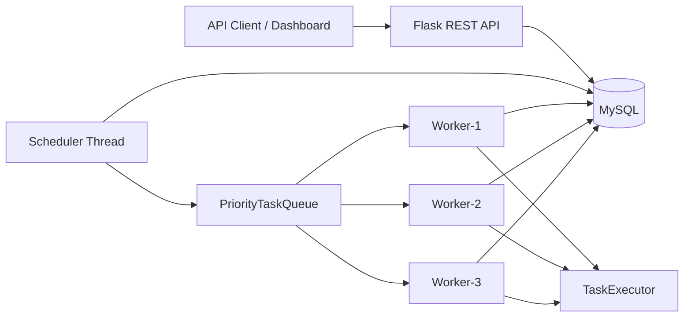

# Distributed Task Scheduler

A production-style portfolio project: a **priority-based distributed task scheduler** with a Flask REST API, MySQL persistence, concurrent background workers, automatic retries with exponential backoff, Swagger docs, Docker Compose, and a live operations dashboard.

---

## 1. Project Overview

Users and clients can:

1. Create jobs with priority and optional future schedule time  
2. Track status through the full lifecycle  
3. Cancel pending work  
4. Retry failed jobs (automatic + manual)  
5. Inspect execution history  
6. Monitor workers and system statistics  
7. Watch live progress on a simple web dashboard  

---

## 2. Features

- Flask REST API (JSON)  
- SQLAlchemy models + Flask-Migrate  
- In-memory **priority queue** (`heapq`) with documented complexities  
- Threaded **scheduler** that enqueues due tasks  
- Multiple concurrent **workers** with heartbeats  
- Safe predefined task executors (no `eval`, no shell)  
- Exponential backoff retries: `delay = 2 ** retry_count`  
- Structured logging  
- pytest suite  
- Swagger UI at `/api/docs/`  
- Docker + Docker Compose (Flask + MySQL 8)  
- Vanilla HTML/CSS/JS dashboard  

---

## 3. Architecture



**Flow**

1. Client creates a task → stored in MySQL as `PENDING` or `SCHEDULED`.  
2. Scheduler polls for due tasks and pushes them into the priority queue.  
3. Idle workers `pop()` the highest-priority ready task.  
4. A worker **claims** the row with a conditional `UPDATE ... WHERE status IN (...)` so only one worker wins.  
5. The worker runs a safe executor, writes an `executions` row, and updates stats.  
6. On failure, `RetryService` schedules another attempt or marks the task permanently `FAILED`.

---

## 4. Tech Stack

| Layer | Technology |
|-------|------------|
| Language | Python 3.11+ |
| API | Flask, Flask-CORS |
| ORM | Flask-SQLAlchemy, SQLAlchemy 2 |
| Migrations | Flask-Migrate / Alembic |
| DB | MySQL 8+ (SQLite for tests) |
| Docs | Flasgger (Swagger / OpenAPI) |
| Tests | pytest, pytest-flask |
| Containers | Docker, Docker Compose |

---

## 5. Project Structure

```text
distributed-task-scheduler/
├── app/
│   ├── models/          # Task, Worker, Execution
│   ├── routes/          # REST + dashboard
│   ├── services/        # Business logic
│   ├── scheduler/       # Priority queue + scheduler
│   ├── workers/         # Worker entrypoints
│   ├── executors/       # Safe task runners
│   ├── utils/           # Logging, validators
│   ├── templates/       # Dashboard HTML
│   └── static/          # Dashboard CSS/JS
├── tests/
├── config/logging.conf
├── scripts/             # seed + demo helpers
├── Dockerfile
├── docker-compose.yml
├── run.py
└── README.md
```

---

## 6. Database Schema

### `tasks`
`id`, `task_name`, `description`, `priority`, `status`, `payload`, `scheduled_at`, `created_at`, `started_at`, `completed_at`, `retry_count`, `max_retries`, `worker_id`, `result`, `error_message`

**Priority:** LOW=1, MEDIUM=2, HIGH=3, CRITICAL=4  
**Status:** PENDING, SCHEDULED, RUNNING, COMPLETED, FAILED, CANCELLED, RETRYING  

### `workers`
`id`, `worker_name`, `status`, `last_heartbeat`, `tasks_completed`, `tasks_failed`, `started_at`  

**Status:** IDLE, BUSY, OFFLINE  

### `executions`
`id`, `task_id`, `worker_id`, `started_at`, `completed_at`, `status`, `result`, `error_message`, `duration`  

Indexes on task `status`, `priority`, `scheduled_at`, and worker `status`.

---

## 7. API Endpoints

| Method | Path | Description |
|--------|------|-------------|
| GET | `/` | Dashboard |
| GET | `/api/docs/` | Swagger UI |
| POST | `/api/tasks` | Create task |
| GET | `/api/tasks` | List (`status`, `priority`, `page`, `limit`) |
| GET | `/api/tasks/<id>` | Get task |
| DELETE | `/api/tasks/<id>` | Delete task |
| POST | `/api/tasks/<id>/cancel` | Cancel pending/scheduled/retrying |
| POST | `/api/tasks/<id>/retry` | Manual retry (FAILED only) |
| GET | `/api/tasks/<id>/executions` | Execution history |
| GET | `/api/workers` | List workers |
| GET | `/api/workers/<id>` | Worker detail |
| GET | `/api/system/stats` | Aggregate counters |
| GET | `/api/system/health` | Health check |

Interactive docs: [http://localhost:5000/api/docs/](http://localhost:5000/api/docs/)

---

## 8. How the Scheduler Works

`SchedulerService` runs on a **daemon thread**:

1. State moves `STARTING → RUNNING` (or `STOPPED` on shutdown).  
2. Every `SCHEDULER_POLL_INTERVAL` seconds it queries due tasks (`scheduled_at IS NULL OR scheduled_at <= now`).  
3. Eligible tasks are pushed into `PriorityTaskQueue` once (deduped by `task_id`).  
4. `stop()` sets an `Event` and joins the thread for graceful shutdown.

---

## 9. How the Priority Queue Works

`PriorityTaskQueue` wraps `heapq` with a thread lock and lazy deletion.

| Operation | Complexity |
|-----------|------------|
| `push` | O(log n) |
| `pop` | O(log n) amortized |
| `peek` | O(1) amortized |
| `remove` | O(1) (lazy invalidate) |
| `size` / `is_empty` | O(1) |

Ordering key: `(-priority, created_at, sequence)` so higher priority wins; equal priority is FIFO (older first).

---

## 10. Worker Architecture

On startup, `WorkerService` starts `NUM_WORKERS` threads (default 3). Each worker:

1. Registers / refreshes a `workers` row  
2. Sends periodic heartbeats  
3. Pops from the shared queue  
4. Claims the DB row atomically → `RUNNING`  
5. Executes via `TaskExecutor`  
6. Writes `executions` + updates worker counters  
7. Returns to `IDLE`

---

## 11. Retry Mechanism

Backoff: **`delay_seconds = 2 ** retry_count`**

With `max_retries = 3`:

| Failure # | `retry_count` after | Status |
|-----------|---------------------|--------|
| 1 | 1 | RETRYING (wait 2s) |
| 2 | 2 | RETRYING (wait 4s) |
| 3 | 3 | RETRYING (wait 8s) |
| 4 | — | FAILED permanently |

Manual retry: `POST /api/tasks/<id>/retry` (FAILED tasks only) resets the counter and re-queues as PENDING.

---

## 12. Concurrency Design

- Shared queue protected by `threading.RLock`  
- Scheduler / workers coordinated with `threading.Event` for stop signals  
- **Claim safety:** `UPDATE tasks SET status='RUNNING' WHERE id=? AND status IN ('PENDING','SCHEDULED','RETRYING')` — `rowcount == 1` means this worker owns the task  
- Avoids two workers executing the same job  

---

## 13. Testing

```bash
python -m venv venv
# Windows
venv\Scripts\activate
# Linux/macOS
source venv/bin/activate

pip install -r requirements.txt
pytest
pytest --cov=app --cov-report=term-missing
```

Tests use in-memory SQLite (`TestingConfig`) and cover creation, validation, queue ordering, FIFO ties, scheduling, cancel/retry, workers, failures, pagination, and API responses.

---

## 14. Docker Setup

```bash
cp .env.example .env
docker compose up --build
```

- App: http://localhost:5000  
- MySQL: localhost:3306  
- Dashboard: http://localhost:5000/  
- Swagger: http://localhost:5000/api/docs/  

Stop with `Ctrl+C` or `docker compose down`.

---

## 15. Local Setup (without Docker)

### Prerequisites
- Python 3.11+  
- MySQL 8+ running locally **or** set `DATABASE_URL=sqlite:///scheduler.db` for a quick demo  

```bash
cp .env.example .env
# edit .env with your MySQL credentials, or add:
# DATABASE_URL=sqlite:///scheduler.db

python -m venv venv

# Windows PowerShell
.\venv\Scripts\Activate.ps1

# Windows CMD
venv\Scripts\activate.bat

# Linux / macOS
source venv/bin/activate

pip install -r requirements.txt
python run.py
```

### Migrations (MySQL)

```bash
set FLASK_APP=run.py          # Windows CMD
$env:FLASK_APP="run.py"       # PowerShell
export FLASK_APP=run.py       # Linux/macOS

# Avoid starting workers while running migration commands
set FLASK_SKIP_RUNTIME=1          # Windows CMD
$env:FLASK_SKIP_RUNTIME="1"       # PowerShell
export FLASK_SKIP_RUNTIME=1       # Linux/macOS

flask db init                 # first time only (already present in repo)
flask db migrate -m "initial"
flask db upgrade
```

On first `python run.py`, `db.create_all()` also creates tables if they are missing (handy for SQLite demos).

### Seed data (optional)

```bash
python scripts/seed.py
```

---

## 16. Example API Requests

```bash
curl -X POST http://localhost:5000/api/tasks ^
  -H "Content-Type: application/json" ^
  -d "{\"task_name\":\"send_email\",\"description\":\"Send welcome email\",\"priority\":\"HIGH\",\"payload\":{\"type\":\"SEND_NOTIFICATION\",\"email\":\"user@example.com\",\"message\":\"Welcome\"},\"scheduled_at\":null,\"max_retries\":3}"
```

Linux/macOS:

```bash
curl -X POST http://localhost:5000/api/tasks \
  -H "Content-Type: application/json" \
  -d '{
    "task_name": "sum_job",
    "priority": "CRITICAL",
    "payload": {"type": "CALCULATE", "operation": "sum", "numbers": [10, 20, 30]},
    "max_retries": 2
  }'
```

### Supported payload types

| `type` | Purpose |
|--------|---------|
| `CALCULATE` | sum / min / max / avg / product |
| `DELAY` | sleep up to 30s |
| `DATA_PROCESSING` | count / unique / sort / filter_truthy |
| `SEND_NOTIFICATION` | simulated delivery |
| `FAIL` | intentional failure (retry demos) |

---

## 17. Example Responses

**Create**

```json
{
  "id": 1,
  "task_name": "send_email",
  "priority": "HIGH",
  "status": "PENDING"
}
```

**Stats**

```json
{
  "total_tasks": 100,
  "pending_tasks": 10,
  "running_tasks": 5,
  "completed_tasks": 70,
  "failed_tasks": 15,
  "active_workers": 3
}
```

---

## 18. Screenshots

> Placeholder — add screenshots of the dashboard, Swagger UI, and a priority demo run here.

---

## 19. Demo Scenario

1. Start the app (`python run.py` or Docker). Workers auto-start (`NUM_WORKERS=3`).  
2. Run the demo helper:

```bash
python scripts/demo_tasks.py
```

This creates Task A–E with LOW / HIGH / CRITICAL / MEDIUM / HIGH priorities plus a failing task for retries. CRITICAL and HIGH should complete before LOW when submitted together.

3. Open the dashboard and watch statuses refresh every 5 seconds.  
4. Cancel a pending task, inspect `/api/tasks/<id>/executions`, and call `/api/system/stats`.

---

## 20. Git Workflow (recommended)

```bash
git init
git add .
git commit -m "Initial commit: distributed task scheduler"
git branch -M main
git remote add origin <your-repo-url>
git push -u origin main
```

Use feature branches for changes; never commit `.env` or secrets.

---

## 21. Important Design Decisions

1. **Predefined executors only** — interview-safe: no arbitrary code or shell.  
2. **DB claim + in-memory queue** — queue for fast priority selection; DB for durable truth and race-free assignment.  
3. **Lazy removal in the heap** — O(1) cancel without expensive heap rebuilds.  
4. **`use_reloader=False`** — prevents duplicate scheduler/worker threads under Flask debug.  
5. **SQLite for tests** — fast CI; MySQL for real/Docker runs.

---

## 22. Future Improvements

- Persist queue state / recover RUNNING tasks after crash  
- Horizontal scaling with Redis/RabbitMQ  
- Authentication / API keys  
- Metrics (Prometheus) and structured JSON logs  
- Dead-letter queue UI  
- Rate limiting per tenant  

---

## License

MIT — see [LICENSE](LICENSE).
